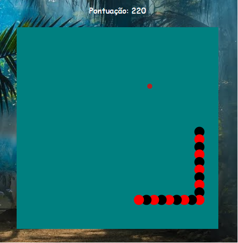
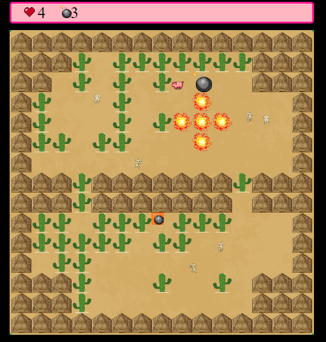

<h1 align="center" href="#clipboard-about">   Hi there, My name is Alexsander Marchi Zunino </h1> 

🎓 &nbsp; I'm 22 years old, currently studying Sytem Development at Senai São José. 
 
💡 &nbsp; My git involve projects that I a developted at class and in my free time.
 
📖 &nbsp; I'm studying nowadays: Data base, React, React Native, JavaScript, TypeScript, HTML5, CSS3, C++ 
 

## 🎮 Games Developed in Class:

 

## 🛠 My abilities:

  
 
    
 
 
 

